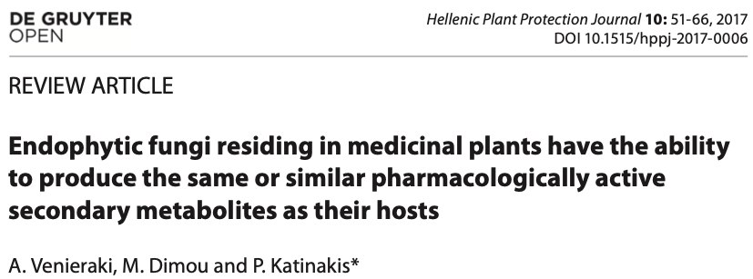
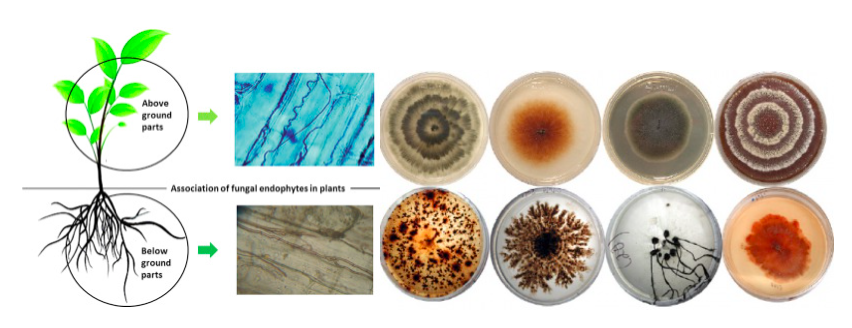
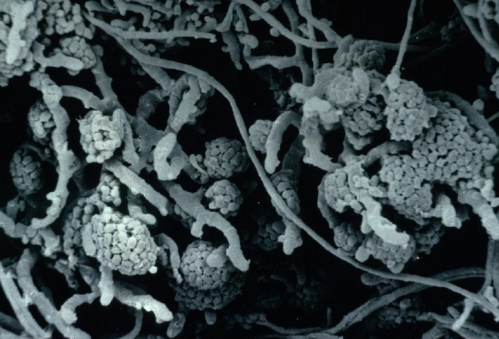
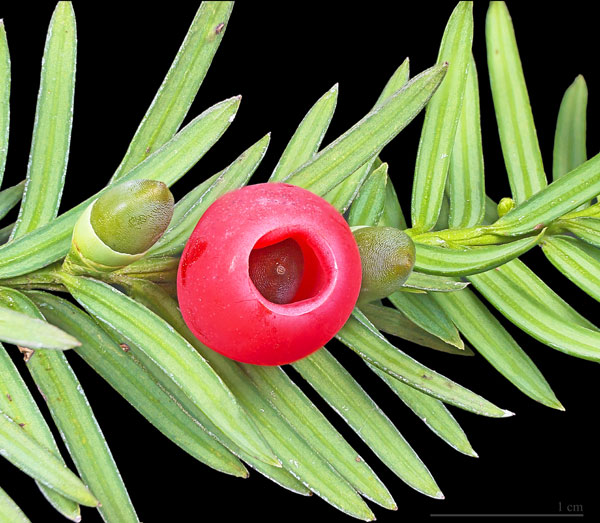

.pull-left[
### Estamos enfrentando la pérdida acelerada de especies de plantas medicinales silvestres.
]
.pull-right[
### La viabilidad de acceder a los compuestos bioactivos de las plantas representa un reto
]

---
###Propuestas:

* Cultivo de tejidos vegetales.
* Total o parcial síntesis química.
* Aporvechando la habilidad de los hongos endófitos de producir los mismos o similares metabolitos secundarios que su planta hospedera.

### Hongos endófitos de plantas
**Definición:** Hongos que colonizan y pasan su ciclo de vida (o parte de él) dentro de los tejidos de la planta sin causarle síntomas visibles de infección.


---
## Objetivos:
* Mostrar que gran número de plantas que son utilizadas para aislar metabolitos secundarios de importancia médica albergan hongos endófitos capaces de biosintetizar los mismos o similares compuestos bioactivos.

* Discutir la evolución y el origen de las rutas involucradas en la biosíntesis de los metabolitos secundarios y las aproximaciones potenciales para mejorar su producción. 

---
# *Taxus brevifolia*

En 1993 se descubrió que ***Taxomyces andreanae***, endófito de *T. brevifolia*, produce también el metabolito secundario **Paclitaxel** (nombre comercial **Taxol**). 

```{r echo=FALSE, fig.align='center', out.width = "500px", out.height="150px"}

```

.pull-left[

```{r echo=FALSE, out.width = "500px", out.height="250px"}

```
]

.pull-right[
```{r echo=FALSE, out.width = "500px", out.height="250px"}

```
]


